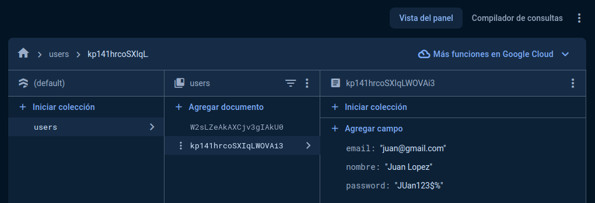

# Descripción del Repositorio
- Este repositorio contiene un proyecto de un formulario al que se le ingresan tres datos (nombre, correo electronico y contraseña) y envia esta informacion a una base de datos en Firebase.

## Tecnologias utilizadas
- Para la realizacion de este proyecto se utilizaron las siguientes tecnologias:
  - [Html](https://developer.mozilla.org/es/docs/Web/HTML): Lenguaje de marcado para esrtuctura basica del proyecto en la web.
  - [Css](https://developer.mozilla.org/es/docs/Web/CSS): Lenguaje de estilos para dar presentacion al proyecto web.
  - [Javascript](https://developer.mozilla.org/es/docs/Web/javascript): Lenguaje de programación para desarrollo de forntend y Backend.
  - [Firebase](https://firebase.google.com/?hl=es): Plataforma de Google para el desarrollo de aplicaciones web y aplicaciones móviles integrada con Google Cloud Platform, que usa un
    conjunto de herramientas para la creación y sincronización de proyectos que serán dotados de alta calidad, haciendo posible el crecimiento del número de usuarios y dando resultado también
    a la obtención de una mayor monetización.

## Imagenes de la aplicación del clima

![Imagen 1 del Formulario (./images/formulario1.png)
![Imagen 2 del formulario(./images/formulario2.png)

- imagen de la base de datos en Firebase:

